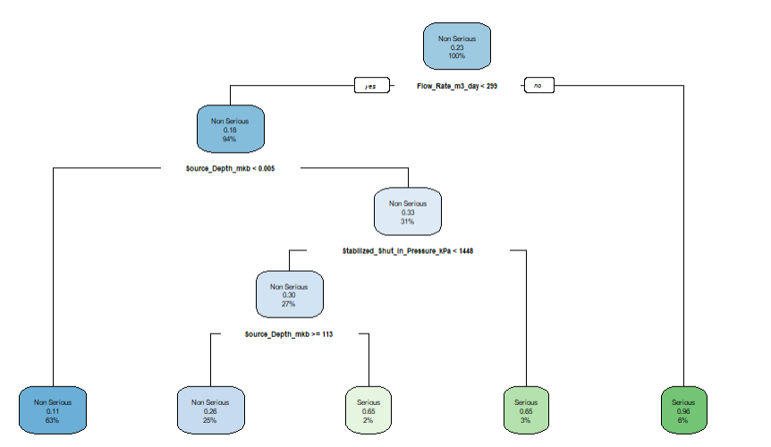

# Vent-Flow Event Severity Classification in Alberta Wells

## Project Overview
Surface Casing Vent Flow (SCVF) and Gas Migration (GM) events in oil and gas wells present environmental hazards, including potential groundwater contamination and greenhouse gas emissions. This project utilizes public dataset records from the **Alberta Energy Regulator (AER)** to model and classify vent-flow event severity (`Serious` vs. `Non-Serious`).

---

## Decision Tree Architecture

### Core Split Rules
* **Flow Rate $\ge 299\ m^3/day$**: Signals high probability ($96\%$) of a **Serious** event.
* **Shut-In Pressure $\ge 1448\ kPa$**: Significant indicator of elevated severity risk.
* **Source Depth $\ge 113\ mkb$**: Interacts with lower surface pressures to drive serious event risk.

---

## Model Evaluation & Performance Comparison

| Approach / Model | Validation Method | Overall Accuracy | Non-Serious Sensitivity | Serious Recall / Specificity |
| :--- | :---: | :---: | :---: | :---: |
| **Decision Tree (Stratified 10-Fold CV)** | 10-Fold CV | **84.05%** | **97.50%** | **45.19%** |
| **Decision Tree (Baseline Split)** | 75/25 Split | 84.19% | 98.14% | 36.94% |
| **Decision Tree (SMOTE Oversampling)** | 5-Fold CV | 79.20% | Balance Adjusted | Improved |
| **Decision Tree (SMOTE Undersampling)** | 5-Fold CV | 78.50% | Balance Adjusted | Improved |

---

## Analytical Workflow
1. `01_data_cleaning_and_preprocessing.Rmd`: Ingestion, string cleaning, category mapping, and output generation[cite: 10].
2. `02_exploratory_data_analysis.Rmd`: Target variable class distributions and feature analysis[cite: 7, 10].
3. `03_decision_tree_10fold_cv.Rmd`: Baseline decision tree trained with Stratified 10-Fold Cross-Validation[cite: 2].
4. `04_smote_oversampling.Rmd` & `04_smote_undersampling.Rmd`: SMOTE resampling methods to mitigate class imbalance[cite: 4, 5].
5. `04_smote_pruned_tree.Rmd`: Cost-complexity (`cp`) tree pruning and parameter tuning[cite: 6].

---

## Repository Artifacts
* `Alberta_VentFlow_Severity_Report.pdf`: Full written project report.
* `cleaned_vent_flow_data.csv`: Cleaned dataset (9,750 records).
* `decision_tree_architecture.png`: Trained decision tree diagram.
